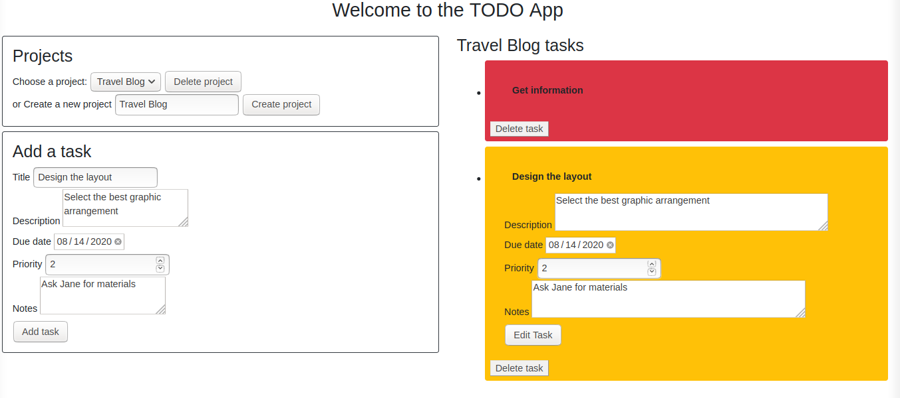

# TODO-APP

The TODO app made with vainilla **JavaScript**, a user can create many projects and add tasks to it, can delete projects and delete tasks, all the projects and all the tasks are stored on **localStorage**.

## Screenshots

## Built with

- Vainilla Javascript (ES6)
- HTML5
- Bootstrap
- Webpack

## Getting Started:

To get a local copy up and running follow these simple example steps:

1. Under the repository name, click the Clone or download green button.

2. Copy the URL given by clicking the clipboard button

3. Open a terminal window in your local machine and change the current directory to the one you
   want the clone directory to be made.

4. Type git clone and then paste the URL you previously copied to the clipboard

5. Install dependencies with `npm install`.

6. Open your web browser and then open the index.html local file that was copied to the project folder

7. Run **webpack** with `npm run watch`

## See a live demo [Here](https://rawcdn.githack.com/Ferm0494/TODO-APP/b23e510c7569a97fbeab8e9850bc75b7062fbce1/dist/index.html/)

## Show your support

Give a ⭐️ if you like this project!

## License

This project is [MIT](https://github.com/Flakster/JS-TicTacToe/blob/master/LICENSE) Licensed

## Authors

👤 Fernando Rivas

- Twitter: [@ferm494](https://twitter.com/ferm494)
- Github: [@Ferm0494](https://github.com/Ferm0494)
- Linkedin: [@Ferm0494](https://www.linkedin.com/in/ferm0494/)

👤 Carlos Santamaría

- Twitter: [@Flakster](https://twitter.com/Flakster)
- Github: [@Flakster](https://github.com/Flakster)
- LinkedIn [@Flakster](https://www.linkedin.com/in/cjsb/)
- Email: contact@carlossantamaria.co
